# Pop-Quizzy

## General Info
The purpose of this challenge was to create a quiz using html, css, and javascript elements that cycled through questions, utilized a responsive timer, and stored and presented the user's score upon completion.

## Creating the Timer
To create the timer feature, I had to first set up a div in the html that would store the #countdown id. This would be connected to the javascript as a function and used to house the timer for the user to view.

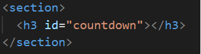

In javascript I created a function called countdown with a variable of timeInterval = setInterval(function ()) inside. This function adds text feedback to the screen to appraise the user of the time left and also iterates down to zero every second (starting from 60).

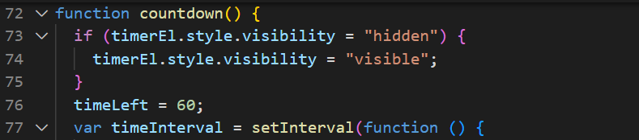

At one second I edited the text to be grammatically correct.

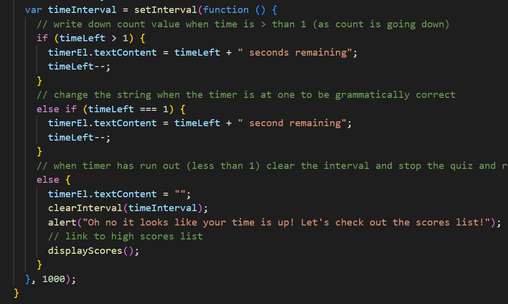

The above features were addressed with an if, else if, and else statement. The last else statement takes into account when the timer reaches zero and when this happens, the user is alerted of the time running out and the high score screen is brought up.

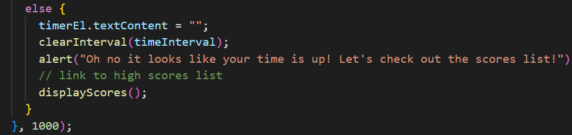

### Time Adjustment Feature
For my quiz, I connected the timer to the result of a correct or incorrect answer. If a question is correct, the user gains 10 seconds to their score but they lose 10 seconds with an incorrect answer.

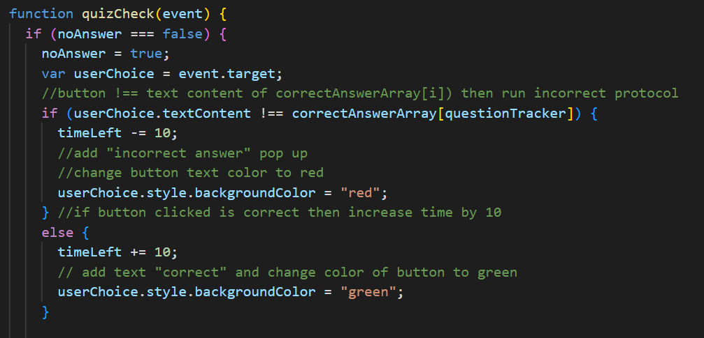

Also shown in this image is a visual change to the answer choice buttons to show the user whether they got an answer correct or incorrect. 

### Quiz Complete Feature
In some situations that timer countdown feature was not needed including when the quiz was already completed or if the user was viewing the high scores list. To stop the timer from continuing to countdown, I had the countdown function check if the question number was greater than the number of questions in the questions array. This would account for the user finishing the quiz. When this happened, the timer would clear out and the "Quiz Complete" text would show.

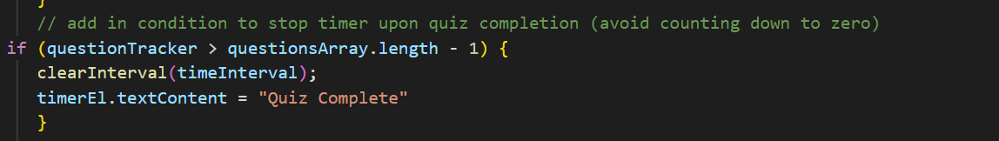

To stop the timer when the user was viewing the high scores list, I followed the logic used above but this time purposefully set the question number greater than the length of the array to trigger the "Quiz Complete" response.

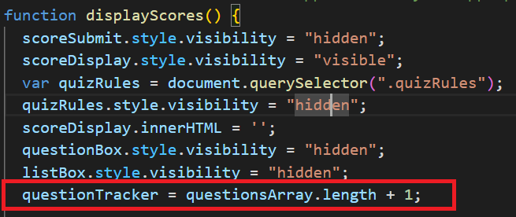

## Process of Setting Up Quiz Responsive Questions
To set up the quiz, I linked an event listener that would run my startQuiz function when the user clicked on the start quiz button. This function generated an ordered list and then populated it with questions and answers from the corresponding questions and answers arrays.

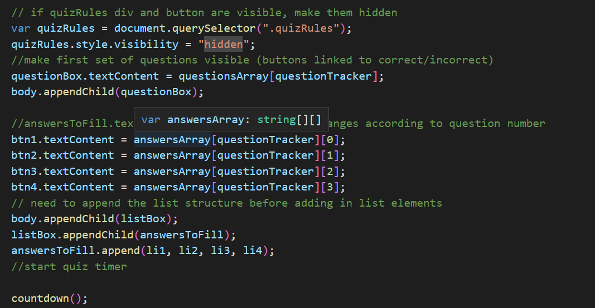

Also shown in the above image is a call to start the countdown. 

At the beginning of the startQuiz function I set up an if statement to set up the local storage if no scores had been tracked yet. This would get the high score list ready for when scores were eventually submitted.

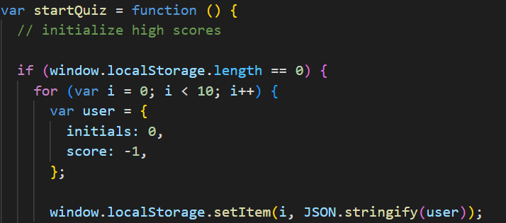

### Checking Answers Feature
Once the quiz started the user needed to have a way to track their score and also get feedback regarding their answer choices. To address their score, I linked each correct answer with an if statement that would result in adding ten seconds if the answer selected matched the answer provided in the correctAnswerArray and a loss of 10 seconds upon an incorrect choice. The buttons would also change colors to signify a correct or incorrect choice.

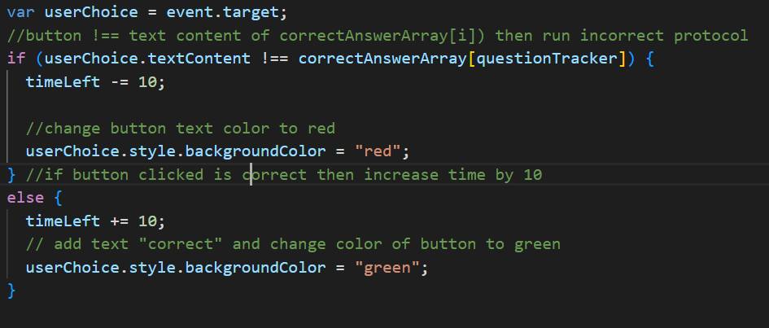

To make the color change relevant I added a slight delay when answer was selected so the user had a second to see feedback before the next question set showed up.

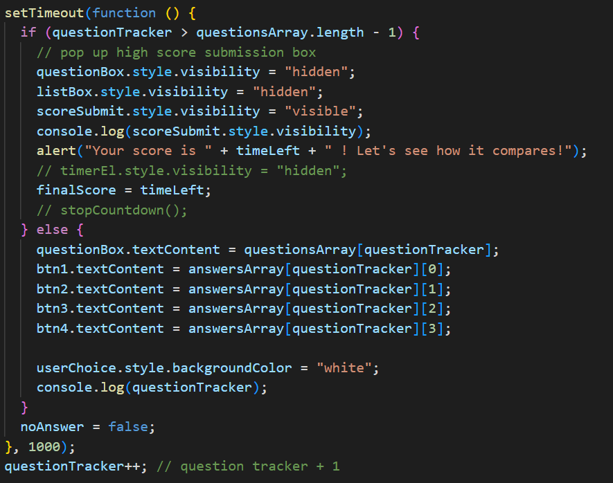

This feature also contributed to checking whether or not more questions and answers would be added or the user had completed the quiz.

I added a boolean value to the answer choices as well so that during the short delay other choices could not be selected and affect the user's score. If there were more questions to switch to, then the value of the boolean variable would revert back.

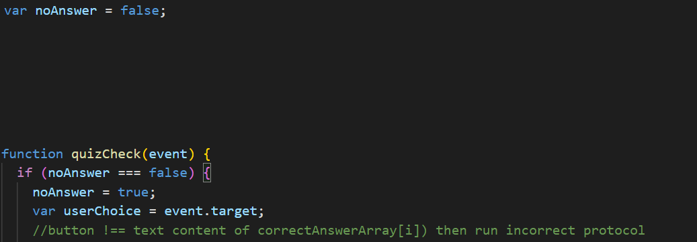

## Setting Up High Score Storage
To collect the user's data and create the high scores page, I saved the user's scores and initials to localStorage and then parsed it with JSON to bring the values back in a usable state. The user's score was tied to the amount of time left on the timer.

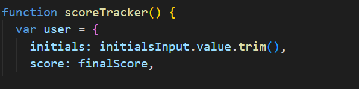

To control the high score list and make sure that it stayed descending order I used two variables. The first variable of "i" was used to locate the correct placement for a potential new top 10 score.

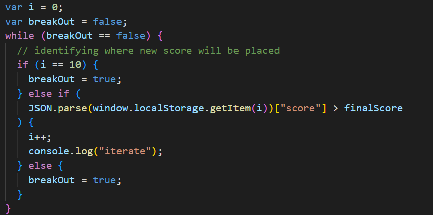

The variable of "j" worked backwards from 9 to actually place the score into the list. This was done to make sure the new score took priority over an existing score and bumped the older or lower score down the list and not up.

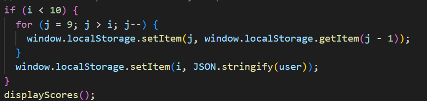

Scores were added to an ordered list using .appendChild and the list itself was then added to the body of the page.

### View High Score Feature
I added a click event to the text "View High Score" that would run the displayScores function and made it fixed to the top of the page. 

I also had to set the visibility of the other containers to "hidden".

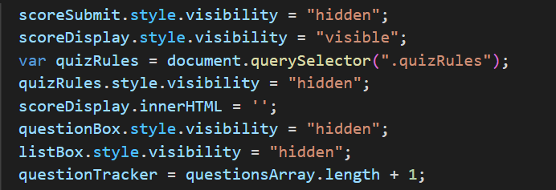

## Links
Github repository link: https://github.com/hvphan1993/Pop-Quizzy.git

Active link: https://hvphan1993.github.io/Pop-Quizzy/